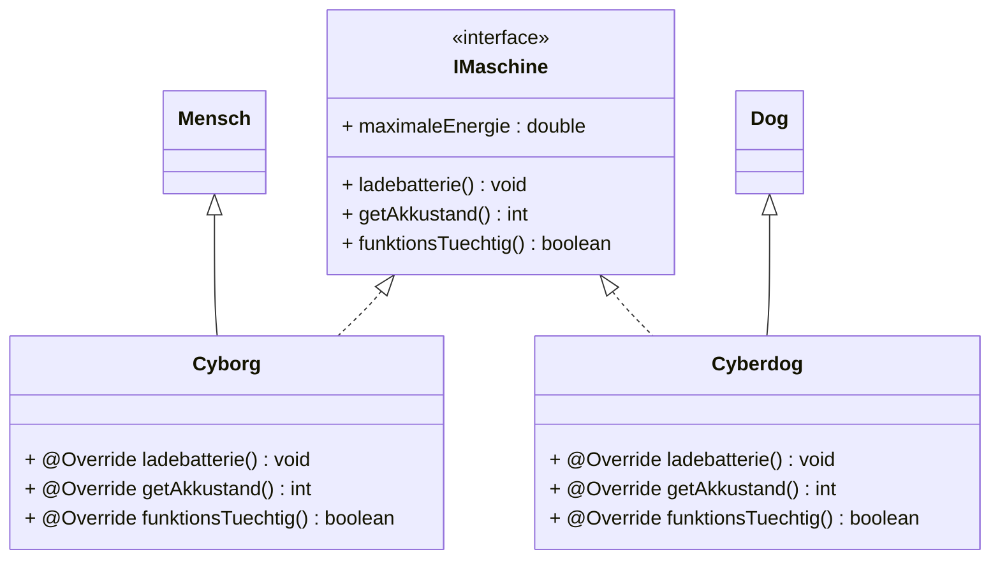

## ressources

- [sql-database](https://github.com/P76ers/javaConsole/blob/main/src/main/java/javaConsole/ressources/onlineshop.sql)

## uebungen

### Grundlagen

#### 1 - Hallo Welt und Kommentare

1. Schreiben Sie ein Programm, das mehrere Textzeilen auf dem Bildschirm ausgibt. Um einen Zeilenumbruch zu erzeugen, 
ist es sinnvoll, anstatt `System.out.print()` den Befehl `System.out.println()` zu verwenden. Auf diese Weise stehen 
die darauffolgenden Inhalte in einer neuen Zeile.
2. Fügen Sie in das eben erstellte Programm Kommentare ein, die das Verständnis erleichtern.
   <br>Bitte geben Sie aus:<br>
   `Herzlich Willkommen zu Java`


#### 2 - Variablen

1. Schreiben Sie ein Programm das den bekannten Ausdruck `Hello World` ausgibt.
2. Geben Sie diesmal mit Hilfe einer Variabel den Ausdruck `Hello World` aus.
3. Geben Sie den Satz `Willkommen bei Java` mit einer Variablen aus.
4. Erstellen Sie zwei Variablen.
   - Die erste Variable hat den Text `Guten Morgen`.
   - Die zweite Variable hat den Text `Alle zusammen!`
   - Die Ausgabe sollte lauten: `Guten Morgen. Alle zusammen!`
   > Tip: Mit dem + Operator können Sie Strings bzw. Zeichenketten verknüpfen.


#### 3 - Operatoren

1. Schreiben Sie ein Programm die eine Variabel mit dem Startwert 8 enthält. Führen Sie jede Folgende Anweisung Schritt 
für Schritt durch und geben Sie nach jedem Schritt das Ergebnis aus.
- Addieren Sie 2 hinzu.
- Subtrahieren Sie 4.
- Multiplizieren Sie mit 5.
- Dividieren Sie 2.
2. Schreiben Sie das gleiche Programm wie in Aufgabe 1. Diesmal dürfen Sie nur die Kurzschreibweise 
(Kombinierte Zuweisungsoperatoren) verwenden. Der Startwert ist 20.
- Addieren Sie 2 hinzu.
- Subtrahieren Sie 4.
- Multiplizieren Sie mit 5.
- Dividieren Sie 2.
- Inkrementieren Sie um 1
- Dekrementieren Sie um 1
3. Schreiben Sie ein Programm das die Addition, Subtraktion, Multiplikation, Division zweier Variablen mit beliebigen 
Werten durchführt und ausgibt

#### 4 - Kontrollstrukturen

Schreiben Sie einen Rabattrechner.

Deklarieren Sie drei Variablen: 

Eine boolesche Variable Stammkunde, eine String Variable für den Namen des Kunden 
`name` sowie eine numerische Variable namens `einkaufswert`. Die Variablen initialisieren Sie mit sinnvollen Werten.

Sofern der Kunde ein Stammkunde ist und `John Conner` heißt, soll er einen Rabatt erhalten. Die Höhe des Rabatts richtet 
sich nach dem Einkaufswert: 
- 2% bei einem Einkaufswert von mindestens 1500€, 
- 5% bei einem Einkaufswert von mind. 
- 2000€ und 10%, wenn der Einkaufswert mindestens bei 3000€ liegt.

Geben Sie am Ende den ursprünglichen Einkaufswert sowie den neuen (gegebenenfalls rabattierten) Einkaufswert auf der 
Konsole aus.

##### 4.2

Simulieren Sie die Funktion eines Taschenrechners mit zwei Operanden für die vier Grundrechenarten und Modulo.

Speichern Sie die Wahl der Rechenart sowie die Werte der beiden zu verrechnenden Operanden in entsprechenden Variablen.

Lassen Sie testweise 44 % 3 rechnen.

(Wenn Sie schon wissen wie man den Input eines Users über die Konsole entgegennimmt schreiben Sie das Programm so, dass 
die Eingabe der Zahlen und die Abfrage der Rechenart erfolgt)

#### 5 - Arrays

1. Erstellen Sie ein eindimensionales Array „meinArray“ von double-Werten mit der Größe 10. 
Die einzelnen Elemente sind `1.1, 2.2, 3.3` usw. Nutzen Sie das Schlüsselwort `new` um das Array zu erstellen. Geben 
Sie alle Elemente aus.
2. Erstellen sie ein Array `Zoo` vom Typ String mit 10 verschiedenen Tieren die selber bestimmen können. Nutzen Sie 
die Kurzschreibweise. Geben Sie alle Elemente aus.

#### 6 - Schleifen

1. Erstellen Sie drei Schleifen, die von 1 bis 10 zählen, verwenden Sie hierfür jeweils einmal eine `while`-, 
eine `for`- und eine `do-while`-Schleife.
2. Erstellen Sie ein Array das verschiedene 5 Auto-Marken enthält. Erstellen Sie eine `foreach`-Schleife, die den Namen 
ausgibt.
3. Gegeben ist ein Array mit den Werten 1 bis 10. Schreiben Sie ein Programm das die Summe der Werte des Arrays 
berechnet.
4. In dieser Übung werden Sie alle Schleifen auf Herz und Nieren prüfen. Schreiben Sie ein
   Skript, das zunächst eine `while`-Schleife, dann eine `do while`-Schleife und schließlich eine `for`-
   Schleifen enthält. Das Skript gibt folgendes im Browser aus:

    ```bash
    abc abc abc abc abc abc abc abc abc
    xyz xyz xyz xyz xyz xyz xyz xyz xyz
    1 2 3 4 5 6 7 8 9
    ```

5. Schreiben Sie ein Programm, das mithilfe einer Schleife die Quadratzahlen bis einschließlich
   10 zeilenweise ausgibt. Bsp: 1*1=1 …usw. 

### OOP

#### 1 - Hund

1. Schreiben Sie eine Klasse namens Hund. Die Klasse hat drei Instanzvariablen `name`, `rasse`, `alter` 
(wählen Sie sinnvolle Datentypen).

Die beiden Instanzvariablen `name` und `rasse` sollen über Parameter-Eingabe im Konstruktor initialisiert werden. 
Das Alter eines neuen Hunde-Objekts soll zu Beginn der Lebzeit sinnvollerweise bei 0 liegen.

Schreiben Sie schließlich noch drei Methoden:
- Die erste heißt `wauMachen()`. Beim Ausführen der Methode wird der Text `WoW!` auf der Konsole ausgegeben.
- Die zweite Methode nennen Sie `alterErhoehen()`. Diese Methode erhöht den Wert der Instanzvariablen alter um +1. 
- Die dritte Methode schließlich heißt `detailsAusgeben()` - sie gibt Name, Rasse und Alter sinnvoll als Text auf dem 
Bildschirm aus.

Wenn sie die Klasse fertiggeschrieben haben, erzeugen Sie ein neues Hunde-Objekt und testen die Methoden.

2. Wir arbeiten weiter mit der oben erstellten Klasse Hund. 
- Erstellen Sie in der Startklasse insgesamt 4 Hunde-Objekte.
- Erstellen Sie nun ein Array, das die Hunde-Objekte aufnimmt.
- Alle vier Hunde haben standardmäßig das Alter von 0. Erhöhen Sie nun mithilfe einer geeigneten Schleifenkonstruktion 
das Alter aller Hunde im Array auf den Wert von 7.

   Geben Sie die Details aller Hunde auf der Konsole aus.

#### 2 - Account

- Erstellen Sie die Klasse Account.
- Die Klasse hat drei private Instanzvariablen name, email, alter (wählen Sie sinnvolle Datentypen).
- Die Instanzvariablen sollen über den Constructor initialisiert werden können.
- Erstellen Sie für alle Instanzvariablen die Getter und Setter.
- Erstellen Sie die Methode `DetailsAusgeben()`.
- In Ihrem Hauptprogramm erstellen Sie ein Array von drei Accounts.
- Geben Sie alle Accounts mithilfe einer Schleife aus.
    
    > Fortgeschritten:
    > 
    > Schreiben Sie das Programm so, dass der Input eines Users abfängt und damit ein neues Account Objekt 
angelegt wird.

#### 3 - Würfelspiel

Ihre Aufgabe ist es ein einfaches Würfelspiel zu erstellen. Das Spiel ist als Simulation zu betrachten wo zwei Spieler 
automatisch eine frei wählbare Anzahl an Runden gegeneinander würfeln.

Bspw.:
- Runde 1: Spieler1 würfelt 6
- Runde 1: Spieler2 würfelt 1
- Ein Punkt für Spieler1
- Runde 2: Spieler1 würfelt 1
- Runde 2: Spieler2 würfelt 2
- Ein Punkt für Spieler2
- Runde 3: Spieler1 würfelt 3
- Runde 3: Spieler2 würfelt 3
- Unentschieden

Nach beispielsweise 20 Runden soll der Gewinner (unentschieden ist auch möglich) ermittelt werden und durch eine 
Ausgabe bekannt gemacht werden.

Sie brauchen zwei Klassen. Eine „Spiel“ und eine „Spieler“ Klasse.

> Tip:
> Zufallszahlen generieren von 1-6
> 
> `Random random = new Random();`
> 
> `aktuellerWurf = random.nextInt(6) + 1`;

#### 4 - Pokemon

Auf der gleichen Basis wie das Würfelspiel können Sie ein kleines Spiel entwickeln wo zwei Pokemons gegeneinander 
antreten. 

Der User soll zwischen zwei Attacken auswählen können (Standard, Super). Dann fügt er dem anderen Pokemon 
einen zufälligen Wert an Schaden zu und reduziert seine Lebenspunkte. Der Gegner Pokemon soll danach eine zufällige 
Attacke ausführen (Standard, Super). 

Das Spiel ist beendet sobald die Lebenspunkte eines der beiden Pokemons 0 (oder weniger) erreicht hat.

#### 5 - Zahlenraten

Schreiben Sie ein Programm, dass eine Zufallszahl von 1 bis 100 generiert. Der User soll diese Zufallszahl erraten. 
Er hat dafür 10 Versuche. 

Bei jedem Versuch soll der Computer antworten ob die gesuchte Zahl niedriger, größer, gleich (gewonnen), 
oder es eine ungültige Eingabe gab (bspw -1 oder 150).

Schreiben Sie Ihr Spiel in eine Klasse.

#### 6 - Hauptmenü für Spiele

Erstellen Sie ein Hauptmenü wo Sie die einzelnen Spiele auswählen können.

#### 7 - Scope

Erstellen Sie die Klasse `Schule`.

Deklarieren und initialisieren Sie die Instanz-Variable `name`. Dieser soll per Constructor übergeben werden können 
(Parameter-Variabel).

Erstellen Sie die Methode `SchuelerAusgeben`. Innerhalb der Methode erstellen Sie ein Array `Schueler` vom Typ `String` 
mit beliebiger Größe und Namen (Lokale-Variabel). Schreiben Sie eine Schleife die es ermöglicht die Namen auszugeben. 
Verwenden Sie eine Schleifen-Variable.

Instanziieren Sie ein Objekt von der Klasse `Schule` mit einem beliebigen Namen für die Schule und rufen Sie die 
Methode `SchuelerAusgeben` auf.

Können Sie auf die Lokale Variabel außerhalb der Methode zugreifen?

#### 8 - Konstruktor

Schreiben Sie eine Klasse namens Smartphone mit insgesamt drei Instanzvariablen: 
- `String hersteller`, 
- `String modell`, 
- `int speicher`.
Die Klasse hat insgesamt vier überladene Konstruktoren, die jeweils folgende Parameterlisten haben:
- `String hersteller, String modell, int speicher`
- `String hersteller, String modell`
- `String hersteller`
- kein Parameter
- 
Verketten Sie die überladenen Konstruktoren!

#### 9 - Methoden

Erstellen Sie eine Klasse Buch mit drei Instanzvariablen `autor`, `titel` und `bewertung` (alle drei vom Typ `String`). 
`autor` und `titel` werden im Konstruktor mit sinnvollen Werten initialisiert.

Die Instanzvariable bewertung dagegen soll innerhalb einer void-Methode mit Parameter initialisiert werden 
(Mögliche Bewertungen sind: `Super`, `gut`, `ganz ok`, `mies`)

Implementieren Sie drei return-Methoden `getAutor()`, `getTitel()` und `getBewertung()`.

Erstellen Sie eine Methode, welche die return-Methoden benutzt und beim Aufrufen die Informationen zum Buch auf der 
Konsole nach folgendem Muster ausgibt:
- `Autor: Daniel Defoe, Titel: Robinson Crusoe, Bewertung: gut`

Fügen Sie der Klasse Buch eine weitere Instanzvariable hinzu: ausgeliehen. Diese soll einen Zähler modellieren, 
der angibt, wie häufig das Buch bereits ausgeliehen worden ist. Fügen Sie eine void-Methode `ausleihen()` hinzu, 
die den Zähler bei jedem Aufruf erhöht.

Überladen Sie die Methode `ausleihen()`, um den Zählerstand frei anzupassen.

#### 10 - Statics

Schreiben Sie eine Klasse „Gegner“, in der die Anzahl der erstellen Objekte dieser Klasse gespeichert wird.

Erstellen Sie dann beliebig viele Gegner in ihrem Hauptprogramm und geben Sie die Anzahl dann aus.

#### 11 - ArrayList

1. Schreiben Sie eine Klasse namens `Mitarbeiter`. Die Klasse hat eine Instanzvariablen `name` 
wählen Sie sinnvolle Datentypen).
   Die Instanzvariablen name soll per Parameter im Konstruktor initialisiert werden.
   Schreiben Sie schließlich noch eine Methode: Die Methode heißt `detailsAusgeben()` - sie gibt Name als Text auf dem 
Bildschirm aus.
2. Erzeugen Sie eine ArrayList (zB in einem Hauptprogramm) von Typ `Mitarbeiter` namens `mitarbeiterListe`. 
In die Liste tragen Sie beispielhaft vier Mitarbeiter ein und geben Sie anschließend in einer Schleife auf der 
Java-Konsole aus.

#### 12 - Objekte Interaktionen

1) Erstellen Sie zwei Klassen: `Verein` und `Mitglied`.
2) Erweitern Sie zunächst die Klasse `Mitglied`, sodass sie zwei Instanzvariablen enthält, nämlich `String name` und 
`int beitrittsjahr`. Die Initialisierung der beiden Variablen soll bei der Objekterzeugung durch Parameterübergabe 
im Konstruktor erfolgen. Schreiben Sie zu den Feldern die passenden return-Methoden 
(`getName()` und `getBeitrittsjahr()`).
3) Nun zur Klasse `Verein`. Wir erzeugen 10 neue Mitglied-Objekte gemäß der neuen Klassendefinition von Mitglied. 
Zusätzlich kommen diese auch gleich in eine nette ArrayList namens `mitgliederListe`.
4) Und jetzt verdienen Sie sich den Props: 
Schreiben Sie eine Methode, die uns Details zu allen Mitgliedern des Vereins auf der Konsole ausgibt, die seit einem 
bestimmten Jahr Mitglied sind. Welches Jahr das ist, wird via Parameterübergabe beim Methodenaufruf festgelegt.
    >Bsp: 
    > 
    > mitgliederanzeigen(int jahr) die alle nach 1999 beigetreten sind.

#### 13 - Banking

- Erstellen Sie zwei Klassen: `Konto` und `Bank`
- Erstellen Sie in der Bank-Klasse eine ArrayList vom Typ `Konto`. Dies soll alle Konten speichern. 
- Erstellen Sie jeweils eine Methode in der Bank-Klasse zum Hinzufügen und Entfernen eines Kontos.
- In einem Hauptprogramm erstellen Sie 4 Konten zum testen.
Fügen Sie diese der Bank hinzu.

#### 14 - Geldautomat

Diese Übung ist dem Aufbau der Taschenrechner Übung sehr ähnlich, aber mit dem Unterschied, dass eine weitere Klasse 
verwendet wird.

Sie sollen einen simulierter Geldautomat programmieren.

Erstellen Sie die Klassen `Hauptprogramm` und `Geldautomat` und `Konto`.

`Konto` soll das Attribut „Guthaben“ besitzen.

Der Geldautomat verwaltet die Konten. Hierfür können Sie ein einfaches Testkonto erstellen.

Im Hauptprogramm soll es ein Auswahlmenü (Switch-Case) für die Operationen `Geld abheben`, `Kontostand anzeigen` geben. 
Dies geschieht über die Klasse `Geldautomat`.

#### 15 - Taschenrechner

Erstellen Sie die Klassen `Hauptprogramm` und `Taschenrechner`.

Im Hauptprogramm soll es ein Auswahlmenü für die Rechenoperation geben.

Die `Taschenrechner` Klasse soll die Grundrechenarten berechnen können.

Je nachdem was der User eingibt soll die jeweilige Rechenart erfolgen.

Beispiel:

```bash
Bitte geben Sie Zahl1 ein:
4
Bitte geben Sie Zahl2 ein:
5
Bitte geben Sie die Operation ein:
+
Ergebnis:
4 + 5 = 9
```

## Vorlesung

### Grundlagen

#### ArrayList

- Deklaration & Initialisierung
- Element...
  - hinzufügen
  - entfernen
  - Zugriff
- Länge ausgeben
- iterieren
- Lambda

#### Exceptions

- Grundsyntax
- Implementierung eigener Exception

#### MySQL

- Exception abfangen
- MySQL-Connecter einbinden
- prepared statements
- stored procedures

#### Arrays

- Deklaration & Initialisierung
- iterieren
- 2-dimensionale Arrys

#### Iteration

- fuss- und kopfgesteueerte Schleifen
- Grundsyntax

#### Operatoren

- aithmetische
- kombinierte
- Pre- und Post In-/Dekrement
- logische Vergleichsoperatoren

#### Scope

Gültigkeitsbereiche von...

- Instanzvariablen
- Parametervariablen
- Methodenvariablen
- Schleifenvariablen
- Blockvariablen

##### Selektion

- Grundsyntax
- `String`-Vergleiche
- Arten von Verzweigungskontrollstrukturen
  - `if else `
  - `switch`

#### Variablen

- Deklaration und Initialisierung
- Datentypen

### Objektorientierte Programmierung

#### Auto

- Zugrissmodifikatoren
- Attribute
- Construcor
- Getter & Setter
- Methoden
- Array Verweisdatentypen

#### Tennis

- Klasse Tennisspieler
- Klasse Turnier

#### Vererbung

##### Abstract


##### Character


##### Interfaces



##### Polymorphie


##### Säugetier

